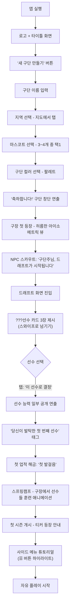
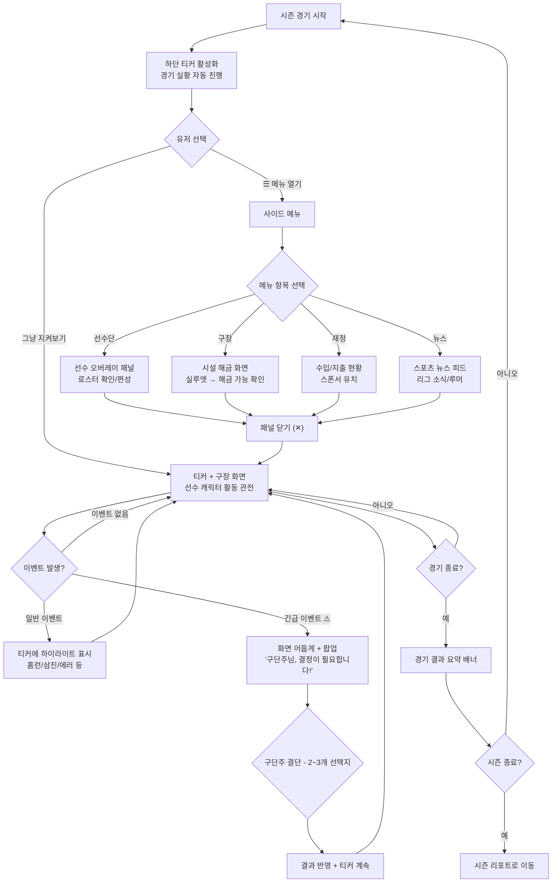
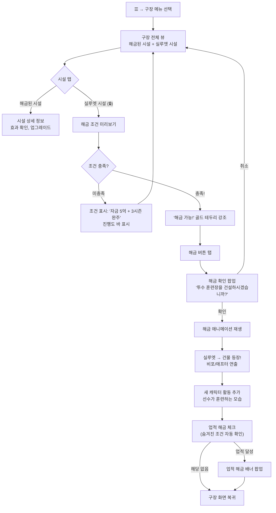
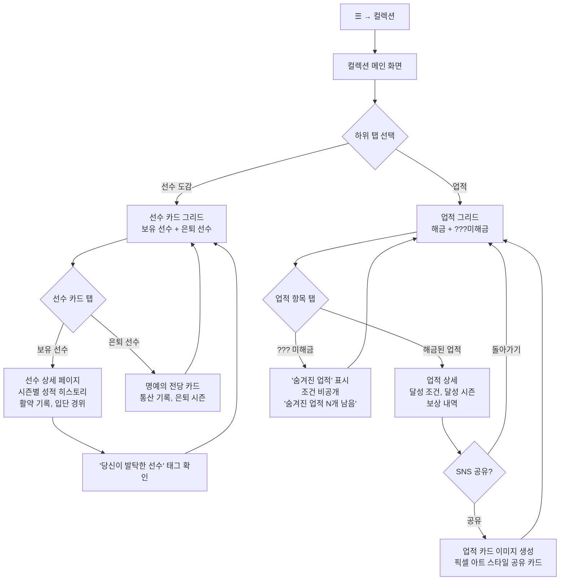
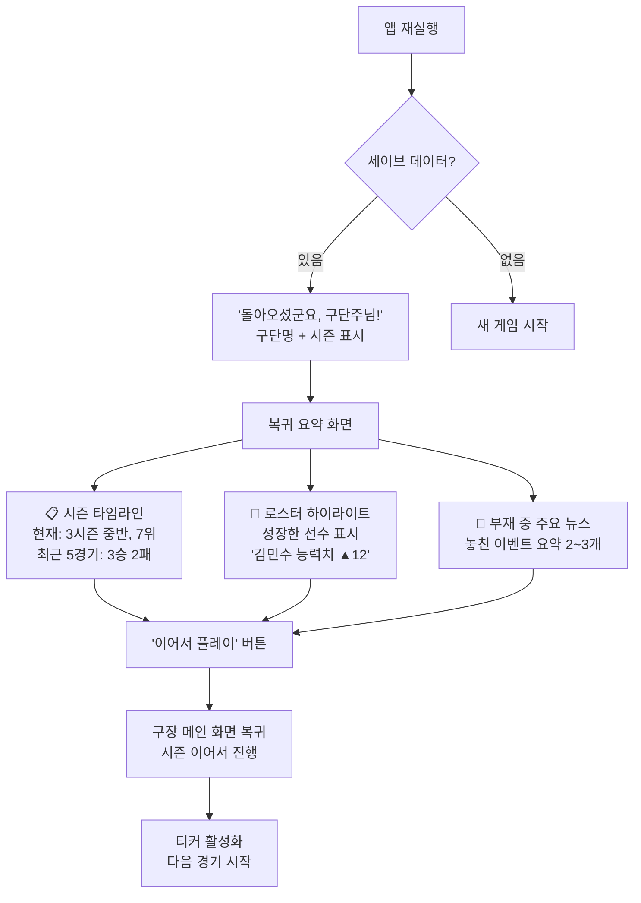

# UX Design Specification 픽셀 야구 타이쿤

**Author:** youme
**Date:** 2026-05-24

---

## Executive Summary

### Project Vision

픽셀 야구 타이쿤은 모바일 야구 게임 시장에서 아무도 시도하지 않은 "구단주 시점의 타이쿤 경영"이라는 새로운 장르를 개척한다. 경기 조작이 아닌 경영 판단이 핵심이며, 허름한 신생 구단이 명문 홈구장으로 성장하는 과정을 픽셀 아트의 따뜻한 비주얼로 전달한다. 하단 티커 경기 실황 위에서 경영 업무를 처리하는 독특한 화면 구조가 이 게임의 UX 정체성이다.

### Target Users

| 페르소나 | 프로필 | 핵심 니즈 | UX 우선순위 |
|---------|--------|----------|------------|
| 민지 (25, 여성) | KBO 팬 + 월간아이돌 경험자 | 귀여운 비주얼, 직관적 진입 | 튜토리얼 UX, 첫 드래프트 경험, 시각적 매력 |
| 현우 (22, 남성) | 카이로소프트 매니아 | 시스템 깊이, 전략적 선택 | FA/트레이드 협상 UI, 방침 설정, 구장 해금 전략 |
| 수빈 (28, 여성) | 헤비 유저, SNS 공유 | 리플레이 가치, 자랑거리 | 시즌 리포트 공유 UI, 뉴게임+ 경험 |
| 지호 (30, 남성) | 이탈-복귀 유저 | 빠른 상황 파악, 짧은 세션 | 시즌 타임라인, 로스터 요약, 세이브 복원 |

### Key Design Challenges

1. **하단 티커 + 경영 멀티태스킹 화면 분할** — 모바일 세로 화면에서 경기 실황(하단)과 경영 UI(상단)를 동시에 보여주면서 정보 과부하 없이 자연스러운 시선 흐름을 만들어야 한다. 초기 유저는 티커만, 익숙해지면 멀티태스킹으로 단계적 복잡도 확장이 필요하다.
2. **해금식 구장 시각적 성장감** — 메인 화면에서 구장의 실루엣→해금 변화가 직관적 보상감을 주면서, 해금 조건과 시설 효과를 명확히 전달해야 한다. 배치가 아닌 해금 방식이므로 "다음에 뭘 열지" 선택의 즐거움을 UI로 표현해야 한다.
3. **한 손 세로 모드 조작** — 출퇴근 지하철에서 엄지 하나로 드래프트, FA 협상, 구장 해금 등 모든 핵심 인터랙션을 처리할 수 있어야 한다. 복잡한 경영 기능을 3탭 이내 도달 + 간결한 선택지로 풀어야 한다.

### Design Opportunities

1. **"내가 키운" 감정의 시각화** — ???선수 발굴→신인왕→에이스 성장 과정을 픽셀 아트 연출로 감정적 보상 극대화. "당신이 발탁한 선수" 피드백이 핵심 쾌감 포인트.
2. **뉴스/기사 UI로 세계관 몰입** — NPC 대화 대신 스포츠 뉴스 피드 형식으로 정보 전달. 모바일에 최적화된 스크롤 UX로 세계관을 자연스럽게 흡수시킨다.
3. **공유 가능한 시즌 리포트** — SNS에 올리고 싶은 픽셀 아트 스타일의 시즌 리포트 카드로 자연스러운 바이럴 마케팅을 유도한다.

## Core User Experience

### Defining Experience

픽셀 야구 타이쿤의 코어 경험은 **"하단 티커로 경기가 흘러가는 동안, 상단에서 구단주로서 경영 판단을 내리는 것"**이다. 유저가 가장 자주 반복하는 행위이자 이 게임의 UX 정체성을 결정짓는 핵심 화면이다. 이 멀티태스킹 화면이 자연스럽지 않으면 게임 전체가 성립하지 않는다.

가장 큰 쾌감은 **"내가 발굴한 선수가 활약하는 것을 보는 것"**이다. ???선수를 직감으로 고르고, 그 선수가 신인왕이 되고, 포스트시즌에서 끝내기 홈런을 치는 순간 — 이 감정적 보상이 10시즌 동안 플레이를 지속시키는 원동력이다.

### Platform Strategy

- **플랫폼:** 모바일 (MVP: Android, Post-MVP: iOS 확장)
- **방향:** 세로 모드 전용, 터치 기반, 한 손(엄지) 조작 최적화
- **연결:** 오프라인 우선. 클라우드 세이브 동기화만 온라인 사용
- **엔진:** Godot Engine, 픽셀 아트 2D 렌더링
- **해상도:** 저해상도 픽셀 아트 → 다양한 화면 크기 스케일링 대응
- **화면 비율:** 16:9 ~ 20:9 대응, 노치/펀치홀 영역 처리

### Effortless Interactions

| 인터랙션 | 자연스러워야 하는 이유 | 설계 방향 |
|---------|---------------------|----------|
| 시즌 진행 흐름 | 유저가 "지금 뭘 해야 하지?"라고 생각하면 실패 | 경기 시작→티커→이벤트→판단→다음 경기가 끊김 없이 반복 |
| 경영 화면 전환 | 티커 위에서 구장/선수/재정을 오가는 것이 핵심 루프 | 탭 하나로 컨텍스트 전환, 경기 중단 없음 |
| 드래프트/스카우트 선택 | "내 눈으로 고르는" 쾌감이 가챠가 아닌 안목의 게임 | ???카드를 넘기며 직감으로 선택, 복잡한 스탯 분석 불필요 |
| 긴급 팝업 대응 | 구단주 결단의 긴장감이 핵심 | 2~3개 선택지 제시, 상황 설명은 한 줄 |
| 시설 해금 | 성장감의 즉각적 시각 피드백 | 탭 한 번으로 해금, 구장 변화 애니메이션 즉시 재생 |

### Critical Success Moments

1. **첫 드래프트** — ???선수를 처음 고르는 순간. "내가 고른" 소유감이 시작되는 지점. 이 경험이 약하면 게임에 감정적 투자가 발생하지 않는다.
2. **첫 긴급 팝업** — "9회말 동점, 구단주님 결정이 필요합니다!" 구단주 정체성을 처음 느끼는 순간. 긴장감과 결단의 쾌감이 동시에 와야 한다.
3. **첫 시설 해금** — 실루엣이 열리며 구장이 시각적으로 변화하는 순간. "내 구단이 커지고 있다"는 성장감의 첫 경험.
4. **첫 시즌 리포트** — D~S 등급과 함께 시즌을 종합 평가하는 순간. "다음엔 더 잘할 수 있겠다"는 동기부여의 기점.
5. **복귀 시 상황 파악** — 앱을 다시 열었을 때 3초 안에 "여기까지 했었지"를 파악하는 순간. 복귀 유저 유지의 핵심.

### Experience Principles

1. **"사장님은 바쁘다"** — 항상 할 일이 있되 강제되지 않는다. 티커가 흘러가는 동안 경영해도, 그냥 지켜봐도 된다. 선택의 자유가 구단주 시점의 핵심이다.
2. **"한 탭의 결단"** — 모든 핵심 판단은 2~3개 선택지 중 하나를 고르는 것. 복잡한 수치 입력 없이 직관적 선택이 전략적 깊이를 만든다.
3. **"눈에 보이는 성장"** — 구장, 선수, 순위, 재정의 모든 성장이 메인 화면에서 시각적으로 드러난다. 숫자가 아닌 픽셀로 성장을 체감한다.
4. **"내가 만든 이야기"** — 시스템이 스토리를 들려주는 게 아니라 유저의 선택이 스토리가 된다. ???선수 발굴, FA 영입, 라이벌 형성 모두 유저의 판단에서 비롯된 서사다.

## Desired Emotional Response

### Primary Emotional Goals

| 순위 | 감정 | 핵심 순간 | 왜 중요한가 |
|------|------|----------|------------|
| 1 | **뿌듯함/소유감** | ???선수 발굴 → 활약 피드백, 구단 성장 | 10시즌 동안 플레이를 지속시키는 원동력. "내가 만든 팀"이라는 애착이 리텐션의 핵심 |
| 2 | **긴장감/떨림** | 9회말 긴급 팝업, FA 경쟁 입찰, 포스트시즌 관전 | 경영 시뮬레이션에 스포츠의 라이브 감동을 불어넣는 차별화 요소 |
| 3 | **성장의 희열** | 시설 해금, 순위 상승, 시즌 등급 향상 | 타이쿤 장르의 본질적 쾌감. 허름한 구장→명문 홈구장의 시각적 변화가 이 감정을 극대화 |

### Emotional Journey Mapping

| 단계 | 유저 상태 | 목표 감정 | 위험 감정 |
|------|----------|----------|----------|
| **첫 만남** (앱스토어→설치) | 호기심 | 기대감, 귀여움 | "또 야구 게임이야?" 무관심 |
| **튜토리얼** (구단 창단→첫 드래프트) | 탐색 | 설렘, 소유감 시작 | 혼란, "뭘 해야 하지?" |
| **첫 시즌** (티커+경영 멀티태스킹) | 학습 | 몰입, 바쁜 즐거움 | 정보 과부하, 지루함 |
| **첫 긴급 팝업** (9회말 동점) | 놀람 | 긴장감, 결단의 쾌감 | 당황, "갑자기 뭐야?" |
| **첫 시즌 리포트** (D~S 등급) | 평가 | 성취감, "다음엔 더" | 좌절, "왜 이렇게 낮아?" |
| **첫 시설 해금** | 보상 | 성장의 희열, 기대감 | "별거 아니네" 실망 |
| **포스트시즌 진출** | 절정 | 뿌듯함, 떨림 | — |
| **10시즌 완주** | 회고 | 레거시 달성감, 여운 | "이제 뭐 하지?" 공허 |
| **복귀** (이탈 후 재접속) | 재탐색 | 반가움, "이어서 해보자" | "어디까지 했더라?" 혼란 |

### Micro-Emotions

**강화해야 할 감정:**
- **자신감** — 드래프트에서 "이 선수가 맞아"라는 확신. ???가 밝혀지는 순간 "역시 내 눈"
- **기대감** — 실루엣 시설을 볼 때 "다음엔 저걸 열어야지". 유망주 성장 그래프를 볼 때 "내년엔 주전이다"
- **유대감** — 내가 1순위로 지명한 선수, 내가 FA로 영입한 에이스에 대한 특별한 애착
- **전략적 만족** — FA 협상에서 "우승 가능성" 카드로 돈 많은 팀을 이겼을 때의 영리함

**방지해야 할 감정:**
- **혼란** — 화면에 정보가 너무 많아서 뭘 봐야 할지 모르는 상태. 특히 티커+경영 멀티태스킹 초기
- **무력감** — 3시즌 연속 꼴찌일 때 "뭘 해도 안 돼". 역드래프트 보상/언더독 이벤트로 희망 유지
- **강제감** — 광고를 봐야만 진행되는 느낌, 특정 행동을 강요받는 느낌. "사장님은 바쁘다" 원칙으로 항상 선택의 자유
- **피로감** — NPC 대화를 스킵하고 싶은 피로. 뉴스/기사 형식으로 이미 해결된 설계

### Design Implications

| 목표 감정 | UX 설계 방향 |
|----------|-------------|
| 뿌듯함/소유감 | "당신이 발탁한 선수" 태그를 활약 시 항상 표시. 구단 커스터마이징(이름, 마스코트)으로 소유감 기반 확보 |
| 긴장감/떨림 | 긴급 팝업은 화면 전체를 어둡게 하고 팝업만 밝게. 시간 압박 연출(카운트다운은 아님, 분위기 연출). 사운드 변화로 긴장 고조 |
| 성장의 희열 | 시설 해금 시 비포/애프터 애니메이션. 시즌 리포트에서 전 시즌 대비 성장 하이라이트. 구장 메인 화면이 매 시즌 조금씩 달라짐 |
| 기대감 | 실루엣 시설에 해금 조건 미리보기. 유망주 "잠재력" 힌트. 다음 시즌 프리뷰 |
| 자신감 | ???선수 능력치 공개 연출을 드라마틱하게. 스카우트 보고서에서 "구단주님의 안목이 적중했습니다" 피드백 |
| 혼란 방지 | 튜토리얼에서 티커만 먼저 보여주고, 경영 UI를 단계적으로 해금. 첫 시즌엔 핵심 기능만 노출 |
| 무력감 방지 | 꼴찌여도 시즌 리포트에서 긍정적 항목(유망주 발굴 A등급 등) 강조. "다음 시즌의 희망" 섹션 |

### Emotional Design Principles

1. **"작은 승리를 자주"** — 큰 우승이 아니어도 매 시즌 성취감을 느낄 수 있는 마이크로 보상 설계. 유망주 각성, 시설 해금, 관중 수 증가 등 작은 성공이 꾸준히 발생해야 한다.
2. **"실패도 서사다"** — 패배와 좌절이 다음 시즌의 동기가 되는 감정 설계. 역드래프트 보상, 언더독 이벤트, "올해는 다르다" 연출로 실패를 희망으로 전환한다.
3. **"내 선택이 만든 감정"** — 시스템이 감정을 주입하는 것이 아니라, 유저의 판단이 감정을 만든다. 내가 고른 선수의 활약, 내가 거절한 트레이드의 후회, 내가 해금한 시설의 뿌듯함.
4. **"귀여움은 안전망"** — 픽셀 아트의 따뜻한 비주얼이 경영 시뮬레이션의 스트레스를 완화한다. 꼴찌여도 선수들이 귀엽게 뛰어다니는 모습이 유저를 붙잡는다.

## UX Pattern Analysis & Inspiration

### Inspiring Products Analysis

#### 월간아이돌

- **핵심 UX 성공 요인:** 캐스팅→육성→활동→성장의 루프가 한 화면 안에서 직관적으로 순환. 복잡한 메뉴 없이 탭 기반 네비게이션으로 핵심 기능에 즉시 접근.
- **온보딩:** 첫 연습생 캐스팅으로 소유감을 즉시 생성. 튜토리얼이 게임플레이 자체에 녹아있어 별도 학습 없이 자연스럽게 시스템을 익힘.
- **정보 계층:** 연습생/아이돌의 상태를 아이콘과 색상으로 한눈에 파악. 상세 스탯은 탭해야 볼 수 있는 2단계 정보 구조.
- **감정 설계:** "내가 키운 아이돌"이 차트 1위를 하는 순간의 뿌듯함. 실패해도 귀여운 비주얼이 스트레스를 완화.
- **리텐션:** 짧은 사이클(앨범 활동 단위)로 "한 판만 더" 유도. 2회차 플레이 시 이전 경험이 전략적 깊이를 더함.

#### 카이로소프트 시리즈 (게임개발스토리, 명문포켓학원 등)

- **핵심 UX 성공 요인:** "사장 시점"의 경영 타이쿤 공식. 모든 것이 자동으로 돌아가되 핵심 판단만 플레이어에게 요구. 화면 위에서 캐릭터가 움직이는 것을 지켜보는 "관전의 재미".
- **온보딩:** 게임 시작 직후 첫 직원 고용→첫 프로젝트 시작으로 즉시 루프 진입. 시스템이 단계적으로 해금되며 자연스럽게 복잡도 증가.
- **정보 계층:** 메인 화면 = 경영 공간(건물/캐릭터 움직임). 상단 바에 핵심 자원(자금, 연구 포인트). 상세 정보는 메뉴에서 접근.
- **감정 설계:** 시설이 하나씩 추가되며 공간이 채워지는 시각적 성장감. 시즌/연도 종료 시 리포트로 성취 확인.
- **네비게이션:** 하단 메뉴 바 + 팝업 방식. 메인 화면을 항상 배경으로 유지하며 그 위에 UI를 오버레이.

#### Retro Bowl

- **핵심 UX 성공 요인:** 극도의 단순화. 경영(로스터 관리, FA)은 간결한 카드 UI로, 경기는 핵심 플레이만 직접 조작. "할 건 다 하는데 복잡하지 않다"의 정점.
- **온보딩:** 설명 최소화. 첫 경기를 바로 시작하고, 경영은 시즌 사이에 자연스럽게 노출.
- **정보 계층:** 선수 카드에 핵심 스탯만 표시 (별점 + 1~2개 특성). 복잡한 통계 없이 직관적 판단 가능.
- **감정 설계:** 승리의 쾌감을 직접적으로 전달. 시즌 리포트에서 "얼마나 잘했나"를 한눈에.
- **수익 모델 UX:** 무료 버전에서 핵심 재미를 충분히 제공. 프리미엄 전환 시점이 자연스러움 (기능 확장 욕구).

### Transferable UX Patterns

**네비게이션 패턴:**

| 참조 | 패턴 | 픽셀 야구 타이쿤 적용 |
|------|------|---------------------|
| 카이로소프트 | 메인 화면 상시 배경 + UI 오버레이 | 구장 메인 화면을 항상 배경으로 유지. 경영 UI는 오버레이 패널로 띄움. 구장의 성장을 항상 볼 수 있음 |
| 월간아이돌 | 하단 탭 바 기반 핵심 기능 접근 | 하단 티커 위에 탭 바 배치. 선수/구장/재정/뉴스 탭으로 3탭 이내 도달 |
| Retro Bowl | 시즌 사이 경영 자연 노출 | 비시즌(드래프트, FA, 구장 확장)을 시즌 종료 후 자연스럽게 순차 제시 |

**인터랙션 패턴:**

| 참조 | 패턴 | 픽셀 야구 타이쿤 적용 |
|------|------|---------------------|
| Retro Bowl | 선수 카드 = 별점 + 핵심 특성 | ???선수 카드: 실루엣 + 힌트 1~2개. 공개된 선수: 포지션 + 핵심 능력 아이콘 + 등급 |
| 월간아이돌 | 캐스팅 = 첫 소유감 생성 | 드래프트 UI를 카드 넘기기(스와이프) 방식으로. 고르는 행위 자체가 쾌감 |
| 카이로소프트 | 단계적 시스템 해금 | 튜토리얼에서 티커만 → 1시즌 후 구장 해금 → 2시즌 후 스폰서 해금 등 점진적 복잡도 |

**비주얼 패턴:**

| 참조 | 패턴 | 픽셀 야구 타이쿤 적용 |
|------|------|---------------------|
| 카이로소프트 | 캐릭터가 공간에서 움직이는 메인 화면 | 구장 화면에서 선수 픽셀 캐릭터가 훈련/경기하는 모습. 시설 해금 시 새 캐릭터 활동 추가 |
| 월간아이돌 | 아이콘 + 색상으로 상태 표현 | 선수 컨디션(초록/노랑/빨강), 시설 상태, 재정 건전성을 색상 아이콘으로 즉시 파악 |
| Retro Bowl | 레트로 픽셀 + 미니멀 UI | 픽셀 아트 캐릭터와 깔끔한 UI 패널의 조합. 정보 과부하 방지 |

### Anti-Patterns to Avoid

| 안티패턴 | 왜 피해야 하는가 | 대안 |
|---------|----------------|------|
| **OOTP/FM식 스프레드시트 UI** | 타겟 유저(민지)가 즉시 이탈. 하드코어 통계 게임이 아님 | 스탯은 아이콘/별점/바 그래프로 시각화. 숫자 나열 금지 |
| **강제 튜토리얼 대화** | 카이로소프트도 NPC 대화가 피로 요소. 뉴스 형식으로 이미 해결한 설계를 훼손하면 안 됨 | 행동으로 배우는 온보딩. 필요 시 한 줄 팁 |
| **복잡한 메뉴 깊이** | 3탭 이상 들어가야 하는 기능은 유저가 찾지 못함 | 모든 핵심 기능 2탭 이내. 메인 화면→탭→기능 |
| **전면 강제 광고** | 월간아이돌의 성공 공식(자발적 시청)을 거스르면 평점 급락 | 보상형 광고만. "광고 보면 스카우트 보고서 추가 열람" 같은 자연스러운 선택지 |
| **실시간 타이머 잠금** | "3시간 후에 훈련 완료" 같은 모바일 게임 관행. 이 게임의 시간은 게임 내 시즌 시간 | 모든 진행은 게임 내 시간 기반. 현실 시간 대기 없음 |
| **과도한 알림/뱃지** | 화면에 빨간 점이 가득하면 경영의 자유가 강제 할 일 목록이 됨 | 알림은 긴급 팝업(연 5~10회)만. 나머지는 유저가 직접 탐색 |

### Design Inspiration Strategy

**채택 (Adopt):**
- 카이로소프트의 "메인 화면 상시 배경 + UI 오버레이" 구조 → 구장 성장이 항상 보이는 설계
- 월간아이돌의 "캐스팅으로 즉시 소유감 생성" → 드래프트 UX
- Retro Bowl의 "별점 + 핵심 특성" 선수 카드 → ???선수 카드 UI
- 카이로소프트의 "단계적 시스템 해금" → 튜토리얼 전략

**변형 (Adapt):**
- 카이로소프트의 "캐릭터가 움직이는 공간" → 구장 화면 + 하단 티커 결합 (카이로에는 없는 멀티태스킹 구조)
- Retro Bowl의 "시즌 사이 경영" → 시즌 중에도 경영 가능하도록 확장 (티커 멀티태스킹)
- 월간아이돌의 "앨범 활동 사이클" → 야구 시즌 사이클(스프링캠프→정규시즌→포스트시즌→비시즌)로 변환

**배제 (Avoid):**
- OOTP/FM의 스프레드시트 중심 UI → 우리 타겟은 캐주얼~미드코어
- 모바일 게임의 실시간 타이머/에너지 시스템 → 게임 내 시간만 사용
- 과도한 UI 뱃지/알림 → "사장님은 바쁘다" 원칙 유지

## Design System Foundation

### Design System Choice

**커스텀 픽셀 UI 시스템** — Godot 엔진 내에서 픽셀 아트 스타일에 맞는 자체 UI 컴포넌트 세트를 설계한다. 기존 웹/앱 디자인 시스템(Material Design, MUI 등)은 이 프로젝트에 적용할 수 없으며, 카이로소프트/월간아이돌과 동일하게 게임 세계관에 녹아드는 인게임 UI를 직접 제작한다.

### Rationale for Selection

| 결정 요인 | 판단 |
|----------|------|
| 플랫폼 | Godot 엔진 기반 모바일 게임 — 웹/앱 UI 프레임워크 사용 불가 |
| 아트 스타일 | 픽셀 아트 — 기존 디자인 시스템의 벡터 기반 컴포넌트와 양립 불가 |
| 팀 규모 | 1인 개발 — 최소한의 컴포넌트로 최대 커버리지 필요 |
| 세계관 일관성 | UI가 게임 세계관의 일부 — 야구장 스코어보드, 스포츠 뉴스 등 야구 감성이 UI에 녹아야 함 |
| 참고 사례 | 카이로소프트, 월간아이돌, Retro Bowl 모두 자체 픽셀 UI 시스템 사용 |

### Implementation Approach

**픽셀 UI 컴포넌트 라이브러리:**

| 컴포넌트 | 용도 | 스타일 방향 |
|---------|------|-----------|
| **카드** | 선수 카드, 시설 카드, 스폰서 카드 | 픽셀 테두리 + 등급별 색상. ???선수는 실루엣 카드 |
| **패널/오버레이** | 경영 UI 화면 (선수/구장/재정/뉴스) | 반투명 배경 + 픽셀 프레임. 구장 메인 화면이 뒤에 보임 |
| **팝업** | 긴급 결단, 이벤트 알림, 확인 대화상자 | 전체 화면 어둡게 + 중앙 팝업. 긴급도에 따라 테두리 색상 변화 |
| **버튼** | 선택지, 확인, 탭 전환 | 픽셀 스타일 버튼. 터치 영역 최소 48dp. 탭 시 눌림 애니메이션 |
| **티커 바** | 하단 경기 실황 | 스코어보드 감성의 가로 스크롤 바. 이닝/점수/주요 이벤트 표시 |
| **탭 바** | 메인 네비게이션 | 티커 바 위 4~5개 아이콘 탭. 선수/구장/재정/뉴스 |
| **프로그레스/게이지** | 선수 능력치, 시설 해금 진행도, 재정 상태 | 픽셀 바 그래프 + 색상 코딩 (초록/노랑/빨강) |
| **뉴스 피드** | 세계관 정보 전달 | 스포츠 신문/뉴스 앱 감성의 스크롤 리스트. 헤드라인 + 썸네일 |
| **리포트** | 시즌 등급, 선수 성적, 레거시 점수 | 인포그래픽 스타일. SNS 공유 시 카드 이미지로 변환 가능 |

**디자인 토큰:**

| 토큰 | 정의 |
|------|------|
| **컬러 팔레트** | 제한된 픽셀 아트 팔레트 (16~32색). 팀 컬러는 팔레트 스왑으로 구현. 색약 대응: 상태 아이콘은 색상+형태로 구분 |
| **타이포그래피** | 픽셀 폰트 (본문 12sp 이상). 한글 가독성 확보를 위해 최소 8×8 픽셀 그리드 |
| **아이콘** | 16×16 또는 32×32 픽셀 아이콘 세트. 포지션, 능력치, 컨디션, 시설 종류별 아이콘 |
| **간격/그리드** | 8px 기반 그리드 시스템. 픽셀 아트의 정수 배율 스케일링과 호환 |
| **애니메이션** | 프레임 기반 픽셀 애니메이션. 시설 해금, 등급 공개, 긴급 팝업 등 핵심 순간에만 사용 |

### Customization Strategy

**구단 테마 시스템:**
- 유저가 선택한 구단 컬러가 UI 전체에 반영 (팔레트 스왑)
- 구단 마스코트가 UI 요소에 등장 (탭 바 아이콘, 리포트 헤더 등)
- 구장 성장 단계에 따라 UI 배경/프레임 스타일이 미묘하게 변화 (허름→화려)

**일관성 규칙:**
- 모든 인터랙티브 요소의 터치 영역 최소 48×48dp
- 정보 계층: 1차(화면에 즉시 보임) → 2차(탭하면 보임) → 3차(메뉴 진입)
- 상태 표현은 항상 색상 + 형태 이중 인코딩 (색약 대응)
- 팝업은 최대 2단계까지만 (팝업 위 팝업 금지)

## Defining Core Interaction

### Defining Experience

**한 줄 정의:** "내 안목으로 선수를 모으고 구단을 키우다 보면, 숨겨진 업적들이 하나씩 해금되며 내 구단만의 역사가 완성된다"

이 게임의 핵심 쾌감은 **컬렉션**이다. 경기 관전과 경영 멀티태스킹은 컬렉션 경험을 감싸는 프레임이며, 유저를 붙잡는 진짜 동력은 "아직 채우지 못한 칸"에 대한 호기심과 "방금 해금된 칸"에 대한 뿌듯함이다.

**컬렉션 2축 구조:**

| 축 | 내용 | 핵심 감정 |
|----|------|----------|
| **선수 컬렉션** | 내가 발굴/영입한 선수들의 도감. ???→능력 공개→활약 기록→은퇴까지의 히스토리 | 소유감, 애착, "내가 키운" 뿌듯함 |
| **업적 컬렉션** | 숨겨진 조건 달성 시 해금. 구장 시설, 시즌 등급, 경기 기록, FA 성공, 특수 이벤트 등 | 놀라움, 탐험, "다음엔 뭐가 있을까" 기대감 |

### User Mental Model

유저는 이 게임을 **"채워나가는 게임"**으로 인식한다.

- **선수 도감**을 채우는 것 = 포켓몬 도감을 채우는 감각. 모든 포지션에 내가 고른 선수를 배치하고, 각 선수의 활약 기록이 쌓이는 것을 보는 재미
- **업적 화면**을 채우는 것 = 트로피/도전과제 시스템. 숨겨진 조건이기 때문에 "이런 것도 있었어?"하는 발견의 즐거움
- **구장이 채워지는 것** = 업적의 시각적 결과물. 업적 달성이 곧 구장 변화로 이어져 메인 화면에서 보임

**기존 솔루션과의 차이:**
- 카드 수집 야구 게임(컴투스 프로야구): 가챠로 선수를 뽑음 → 이 게임은 "내 안목"으로 고름
- 카이로소프트: 달성 요소가 있지만 명시적 컬렉션 시스템은 약함 → 이 게임은 컬렉션 자체가 핵심 동기
- 월간아이돌: 아이돌 육성에 집중 → 이 게임은 선수 + 업적 2축 컬렉션

### Success Criteria

| 기준 | 성공 지표 |
|------|----------|
| 컬렉션 몰입 | 유저가 선수 도감/업적 화면을 자발적으로 반복 확인 |
| 숨겨진 달성의 놀라움 | "이런 업적도 있었어?" 반응. 예측 불가한 타이밍에 해금 |
| 리플레이 동기 | "1회차에서 못 채운 컬렉션을 2회차에서 채워야지" |
| 선수 애착 | 특정 선수의 도감 페이지를 반복해서 열어봄 |
| 공유 욕구 | 희귀 업적 달성 시 스크린샷을 찍어 SNS에 공유 |

### Novel UX Patterns

**혁신 요소: 숨겨진 업적 해금 + 컬렉션 피드백**

이 게임의 컬렉션은 기존 트로피/도전과제 시스템과 다르다:
- **조건이 숨겨져 있다** — "다음 업적: OO를 달성하세요"가 아니라, 플레이하다 보면 예상치 못한 순간에 해금. 탐험과 발견의 재미
- **시각적 결과가 있다** — 업적이 단순 뱃지가 아니라, 구장 시설 해금/선수 도감 기록 등 게임 세계에 실체로 반영
- **2회차 동기** — 1회차에서 발견하지 못한 숨겨진 업적이 2회차의 플레이 동기가 됨

**교육 방식:**
- 첫 업적 해금은 튜토리얼 중 자연스럽게 발생 (예: 첫 드래프트 완료 → "첫 발걸음" 업적 해금)
- 컬렉션 화면에서 해금된 것만 보이고, 미해금 항목은 실루엣 또는 "???"으로 표시
- 해금 가능한 총 개수만 표시하여 "아직 더 있다"는 기대감 유지

### Experience Mechanics

**1. 선수 컬렉션 메커닉:**

| 단계 | 유저 행동 | 시스템 반응 | 감정 |
|------|----------|-----------|------|
| 발굴 | 드래프트/스카우트에서 ???선수 선택 | 선수 도감에 실루엣으로 등록 | 기대감 |
| 공개 | 시즌 진행 중 선수 능력치 점진적 공개 | 도감 카드에 정보 추가 | 확인의 쾌감 |
| 활약 | 선수가 경기에서 활약 | "당신이 발탁한 선수" 태그 + 도감에 하이라이트 기록 추가 | 뿌듯함 |
| 성장 | 시즌을 거치며 선수 성장 | 도감에 시즌별 성적 히스토리 누적 | 애착 |

**2. 업적 컬렉션 메커닉:**

| 단계 | 트리거 | 시스템 반응 | 감정 |
|------|--------|-----------|------|
| 달성 | 숨겨진 조건 충족 (유저 모름) | 화면에 업적 해금 배너 팝업 + 효과음 | 놀라움, 기쁨 |
| 확인 | 유저가 컬렉션 화면으로 이동 | 새 업적 카드 표시 + 보상 안내 (시설 해금/보너스 등) | 만족, 탐색 욕구 |
| 탐색 | 컬렉션 화면에서 미해금 항목 확인 | ???실루엣 + "숨겨진 업적 N개 남음" | 기대감, "뭘 하면 열릴까?" |
| 반복 | 다음 플레이에서 새 업적 발견 | 같은 루프 반복 | 지속적 동기 |

**3. 컬렉션 접근 UX:**
- 메인 화면 탭 바에 "컬렉션" 탭 (또는 구단 역사/도감)
- 선수 도감과 업적은 하위 탭으로 구분
- 새로 해금된 항목에만 "NEW" 표시 (과도한 뱃지 금지 원칙 유지)
- 시즌 리포트에서 "이번 시즌 새로 해금된 업적" 섹션 포함

## Visual Design Foundation

### Color System

**베이스 팔레트 (24색 기준):**

| 카테고리 | 색상 역할 | 톤 방향 | 사용 맥락 |
|---------|----------|---------|----------|
| **배경** | 구장 잔디, 흙, 하늘 | 자연색 계열 (따뜻한 녹색, 갈색, 하늘색) | 메인 화면 구장 배경. 시간대(낮/야간 경기)에 따라 팔레트 시프트 |
| **UI 프레임** | 패널 배경, 테두리 | 짙은 네이비~차콜 | 경영 오버레이 패널. 구장 배경과 시각적 분리 |
| **강조** | 핵심 액션, 선택된 상태 | 야구공 화이트 + 팀 프라이머리 컬러 | 버튼, 선택된 탭, 중요 수치 |
| **텍스트** | 본문, 제목, 비활성 | 화이트 → 라이트 그레이 → 미디엄 그레이 | 3단계 텍스트 위계. 어두운 UI 패널 위 밝은 텍스트 |

**시맨틱 컬러 매핑:**

| 시맨틱 | 용도 | 색상 방향 | 보조 표현 (색약 대응) |
|--------|------|----------|---------------------|
| **긍정/성공** | 컨디션 좋음, 승리, 수입 | 초록 계열 | ▲ 위쪽 화살표, 웃는 아이콘 |
| **주의/보통** | 컨디션 보통, 주의 필요 | 노랑 계열 | ━ 수평선, 보통 아이콘 |
| **위험/실패** | 컨디션 나쁨, 패배, 적자 | 빨강 계열 | ▼ 아래 화살표, 찡그린 아이콘 |
| **정보** | 뉴스, 이벤트 알림 | 하늘색 계열 | ⓘ 정보 아이콘 |
| **특별/희귀** | 희귀 업적, S등급, 숨겨진 해금 | 금색/보라 계열 | ★ 별 아이콘, 반짝임 애니메이션 |
| **비활성** | 미해금 시설, ???선수 | 어두운 회색 + 실루엣 | 자물쇠 아이콘, 점선 테두리 |

**팀 컬러 시스템:**
- 12팀 각각 프라이머리+세컨더리 2색 조합
- 유저 구단 컬러가 UI 전체 강조색에 반영 (팔레트 스왑)
- 상대팀 컬러는 경기 티커와 대전 화면에서만 사용
- 팀 컬러 간 충돌 방지: 대전 시 명도 차이 보장

### Typography System

**픽셀 폰트 계층:**

| 레벨 | 용도 | 크기 | 스타일 |
|------|------|------|--------|
| **H1 (대제목)** | 시즌 리포트 제목, 업적 해금 배너 | 24sp (3x 기본) | 볼드, 팀 컬러 또는 금색 |
| **H2 (소제목)** | 패널 제목, 섹션 헤더 | 16sp (2x 기본) | 볼드, 화이트 |
| **본문** | 뉴스 기사, 선수 정보, 설명 텍스트 | 12sp (기본) | 레귤러, 라이트 그레이 |
| **캡션/수치** | 스탯 라벨, 보조 정보, 날짜 | 8sp | 레귤러, 미디엄 그레이 |
| **티커 텍스트** | 하단 경기 실황 | 12sp | 볼드, 고대비 (스코어보드 감성) |
| **팝업 텍스트** | 긴급 결단, 이벤트 | 16sp | 볼드, 화이트. 선택지는 12sp |

**한글 가독성 규칙:**
- 픽셀 폰트 최소 8×8 그리드 (한글 자모 구분 보장)
- 본문 12sp 미만 사용 금지 (캡션/수치 8sp는 숫자·영문 위주)
- 줄간격: 글자 높이의 150% (12sp 본문 → 18sp 줄간격)
- 한 줄 최대 폭: 화면 너비의 80% (양쪽 여백 10%씩)

### Spacing & Layout Foundation

**8px 그리드 시스템:**

| 토큰 | 값 | 용도 |
|------|-----|------|
| `space-xs` | 4px (0.5 단위) | 아이콘과 라벨 사이, 인라인 요소 간격 |
| `space-sm` | 8px (1 단위) | 리스트 항목 간격, 카드 내부 패딩 |
| `space-md` | 16px (2 단위) | 섹션 간 간격, 패널 내부 패딩 |
| `space-lg` | 24px (3 단위) | 주요 영역 간 분리 |
| `space-xl` | 32px (4 단위) | 화면 상하단 여백, 팝업 외부 패딩 |

**화면 분할 레이아웃:**

```
┌─────────────────────┐
│   상태 바 (24px)     │ ← 시간, 자금, 시즌 정보
├─────────────────────┤
│                     │
│   메인 영역          │ ← 구장 배경 + 경영 오버레이
│   (가변, 화면의 ~70%)│    패널/카드/팝업이 이 위에 표시
│                     │
├─────────────────────┤
│   탭 바 (48px)       │ ← 선수/구장/재정/컬렉션/뉴스
├─────────────────────┤
│   티커 바 (56px)     │ ← 경기 실황 스코어보드
└─────────────────────┘
```

- 메인 영역: 구장 배경이 항상 보이며, 경영 UI는 반투명 오버레이로 표시
- 탭 바 + 티커 바: 화면 하단 고정. 엄지 조작 최적 영역
- 팝업: 메인 영역 중앙에 표시, 배경 어둡게 처리
- 노치/펀치홀: 상태 바 영역에서 흡수. 게임 콘텐츠는 세이프 에어리어 내부

**터치 영역 규칙:**
- 모든 인터랙티브 요소: 최소 48×48dp 터치 영역
- 인접 터치 영역 간 최소 간격: 8dp
- 엄지 도달 범위: 핵심 액션 버튼은 화면 하단 2/3 이내 배치
- 스와이프: 선수 카드 넘기기, 뉴스 피드 스크롤 등 자연스러운 제스처 지원

### Accessibility Considerations

**시각 접근성:**

| 항목 | 기준 | 적용 |
|------|------|------|
| 색상 대비 | WCAG AA (4.5:1 이상) | 텍스트-배경 간 대비. 픽셀 아트 특성상 안티앨리어싱 없으므로 명확한 명도 차이 필수 |
| 색약 대응 | 색상+형태 이중 인코딩 | 모든 상태 표시(컨디션, 재정, 등급)에 색상 외 아이콘/형태 병행 |
| 텍스트 크기 | 본문 최소 12sp | 한글 가독성 기준. 시스템 접근성 설정과 연동 검토 |
| 깜빡임 | 초당 3회 미만 | 업적 해금, 긴급 팝업 등 연출에서 과도한 깜빡임 방지 |

**조작 접근성:**
- 한 손(엄지) 조작 기본 지원
- 핵심 판단에 실시간 시간 압박 없음 (긴급 팝업은 분위기 연출일 뿐, 타이머 아님)
- 모든 텍스트 자동 스크롤은 유저가 속도 조절 또는 일시정지 가능
- 티커 바 텍스트 속도 설정 제공

**인지 접근성:**
- 단계적 복잡도 해금: 첫 시즌은 핵심 기능만 노출
- 정보 계층 3단계: 즉시 보임 → 탭하면 보임 → 메뉴 진입
- 긴급 팝업 선택지 최대 3개, 각 선택지에 한 줄 설명
- 뉴스/기사 형식으로 텍스트 피로 최소화

## Design Direction Decision

### Design Directions Explored

4가지 디자인 방향을 탐색함:

| 방향 | 컨셉 | 강점 | 약점 |
|------|------|------|------|
| 1. 스코어보드 클래식 | 야구장 전광판을 UI 전체에 녹인 방향 | 야구팬 즉각 몰입, 세계관 일관성 | 귀여움 약함, 여성 유저 진입 장벽 |
| 2. **미니 월드** ✅ | 아이소메트릭 구장 중심 미니어처 세계 | 생동감, 시설 해금 보상 극대화 | 아이소메트릭 개발 비용 |
| 3. 카드 매니저 | 선수 카드/컬렉션이 메인 화면 중심 | 컬렉션 UX 직결, 카드 넘기기 쾌감 | 구장 성장 가시성 약함 |
| 4. 스플릿 스크린 하이브리드 | 구장 배경 + 카드 오버레이 결합 | 구장 성장+컬렉션 동시 커버 | 오버레이 레이어 구현 복잡 |

### Chosen Direction

**"미니 월드" + 사이드 메뉴 네비게이션**

아이소메트릭 구장을 메인 화면의 중심에 두고, 캐릭터가 돌아다니며 시설이 해금되면 새 건물과 활동이 등장하는 살아 있는 미니어처 세계. 하단 탭 바 대신 ☰ 메뉴 버튼을 눌러 좌측 사이드 메뉴로 네비게이션한다.

**화면 구조:**

```
┌─────────────────────┐
│ ☰  ⭐3시즌 💰2.4억 📊4위│ ← 상태바 + 메뉴 버튼
├─────────────────────┤
│      ☁️  ☁️           │
│  🏟️ [아이소메트릭 구장] │ ← 메인 영역 (최대 확보)
│  🏃👤👤 선수들 활동   │    시설 해금 시 건물 등장
│  🌳  🏋️  🏪  🔒     │    캐릭터가 돌아다님
├─────────────────────┤
│ ⚾ 3회초 서울 2:1 부산 │ ← 하단 고정 티커
└─────────────────────┘
```

### Design Rationale

- **구장 성장 극대화** — 탭 바를 제거하고 사이드 메뉴로 전환하여 메인 영역을 최대한 확보. 해금식 구장 성장이 화면 전체에서 체감됨
- **살아 있는 세계** — 월간아이돌/카이로소프트의 "캐릭터가 공간에서 움직이는" 성공 패턴 적용. 시설 해금 시 새 캐릭터 활동이 추가되어 시각적 보상 즉각 전달
- **사이드 메뉴 확장성** — 시즌 진행에 따라 기능이 단계적으로 해금될 때, 사이드 메뉴에 항목을 자연스럽게 추가 가능. 아이콘+텍스트 라벨로 직관적
- **따뜻한 소유감** — 아이소메트릭 미니어처 뷰가 "내 작은 구단"이라는 소유감을 강화. 타겟 유저(민지)에게 귀여움으로 진입 장벽 낮춤
- **낮/밤 전환** — 경기 시간대에 따라 배경 팔레트 시프트로 시각적 다양성 확보

### Implementation Approach

| 요소 | 구현 방향 |
|------|----------|
| **네비게이션** | ☰ 버튼(상단 좌측) 또는 좌측 스와이프로 사이드 메뉴 토글. 메뉴 밖 터치로 닫기. 메뉴 오픈 시 배경 어둡게 처리 |
| **메인 화면** | 아이소메트릭 구장 뷰. 시설 해금에 따라 건물·캐릭터 활동 동적 추가. 탭 바 없이 최대 영역 확보 |
| **경영 UI** | 사이드 메뉴에서 기능 선택 → 구장 위 반투명 오버레이 패널로 표시. ✕ 버튼으로 닫기 |
| **티커** | 하단 44~56px 고정. 경기 진행 중 항상 표시. 사이드 메뉴 오픈 시에도 유지 |
| **긴급 팝업** | 전체 화면 어둡게 + 중앙 팝업. 2~3개 선택지. 메뉴 불필요 |
| **컬렉션** | 사이드 메뉴에서 진입. 전체 화면 전환 (구장 위 오버레이가 아닌 별도 화면). 선수 도감/업적 하위 탭 |
| **낮/밤** | 경기 시간대에 따라 배경 팔레트 시프트 (하늘색 변화 + 조명탑 효과 + 별) |
| **사이드 메뉴 항목** | 구장, 선수단, 재정, 로스터, 컬렉션, 뉴스, 순위표, 설정. 새 알림에 뱃지 표시 |

**참고 목업:** `docs/ux-design-directions.html` — 6개 핵심 화면의 인터랙티브 HTML 목업

## User Journey Flows

PRD의 4개 유저 저니(민지/현우/수빈/지호)에서 UX 설계가 가장 중요한 5개 핵심 플로우를 설계한다.

### 온보딩 & 첫 드래프트 (민지 저니)

유저가 앱을 처음 열고 소유감이 생기는 순간까지의 흐름.



**핵심 설계 원칙:**
- 구단 창단(D~G)은 **4단계, 각 1탭**으로 완료. 총 소요 시간 1~2분
- 드래프트는 **스와이프 카드** 방식으로 "고르는 행위 자체가 쾌감"
- 첫 업적 해금을 자연스럽게 삽입하여 컬렉션 시스템을 무의식적으로 학습
- 사이드 메뉴는 첫 시즌 시작 후에 안내 (정보 과부하 방지)

### 시즌 경기 + 경영 멀티태스킹 (현우 저니)

게임의 코어 루프 — 티커가 흘러가는 동안 경영하는 흐름.



**핵심 설계 원칙:**
- 티커는 **항상 하단 고정** — 사이드 메뉴 오픈, 오버레이 패널 표시 중에도 유지
- 경영 UI는 **오버레이 패널**로 구장 위에 겹침 → 구장 배경 일부 보임
- 긴급 팝업은 **시즌 당 5~10회**로 제한. 나머지는 유저가 자발적으로 탐색
- "사장님은 바쁘다" 원칙: 경영해도, 그냥 지켜봐도 OK

### 시설 해금 & 구장 성장 (현우/민지 공통)

미니 월드 디자인의 핵심 보상 — 구장이 성장하는 흐름.



**핵심 설계 원칙:**
- 실루엣 시설은 **"다음에 뭘 열지" 선택의 즐거움**을 시각화
- 해금 순간의 **비포/애프터 애니메이션**이 핵심 보상 피드백
- 해금 후 구장에 **즉시 새 캐릭터 활동이 추가**되어 살아있는 느낌
- 업적 해금은 **자동 체크** — 유저가 인지하지 못한 숨겨진 조건 달성 시 깜짝 보상

### 컬렉션 탐색 & 업적 발견 (수빈 저니)

2축 컬렉션 시스템의 탐색 흐름.



**핵심 설계 원칙:**
- 선수 도감은 **시즌별 히스토리 누적** — "내가 키운" 서사의 기록
- 업적은 **조건이 숨겨져** 있어 발견의 즐거움. "이런 것도 있었어?" 반응 유도
- 미해금 항목은 **총 개수만 표시** — "아직 더 있다" 기대감 유지
- 공유 기능은 **픽셀 아트 스타일 카드 이미지**로 생성 — 바이럴 설계

### 복귀 유저 경험 (지호 저니)

이탈 후 돌아온 유저가 빠르게 복귀하는 흐름.



**핵심 설계 원칙:**
- 복귀 요약은 **한 화면에 3개 핵심 정보** — 3초 안에 상황 파악
- 성장한 선수를 강조하여 **애착 재점화** — "이 선수 많이 컸네"
- "이어서 플레이" 버튼으로 **1탭 복귀** — 재학습 부담 제로

### Journey Patterns

| 패턴 | 설명 | 적용 플로우 |
|------|------|-----------|
| **오버레이 패널** | 사이드 메뉴 → 기능 선택 → 구장 위 반투명 패널 → ✕로 닫기 | 선수단, 재정, 뉴스 등 모든 경영 UI |
| **카드 스와이프** | 좌우 스와이프로 카드를 넘기며 선택 | 드래프트, 선수 도감, FA 후보 비교 |
| **숨겨진 해금 배너** | 조건 충족 시 화면 상단 배너 팝업 + 효과음 | 업적 해금, 시설 해금 가능 알림 |
| **한 줄 요약 + 상세 진입** | 메인 화면에 핵심 정보 1줄 → 탭하면 상세 | 티커 이벤트, 뉴스 헤드라인, 선수 카드 |
| **확인 팝업** | 중요 결정 전 1단계 확인 → 결과 연출 | 시설 해금, FA 계약, 트레이드 |
| **1탭 복귀** | 이탈 유저를 위한 최소 인터랙션 복귀 | 세이브 복원, 시즌 이어서 |

### Flow Optimization Principles

1. **"3초 규칙"** — 모든 화면 진입 후 3초 안에 핵심 정보를 파악할 수 있어야 한다. 구장 화면(현재 상태), 복귀 화면(어디까지 했는지), 시즌 리포트(잘했는지 못했는지).

2. **"2탭 도달"** — 핵심 기능은 ☰ 메뉴 → 항목 선택으로 최대 2탭 이내 도달. 긴급 팝업은 0탭(자동 표시).

3. **"경기는 멈추지 않는다"** — 사이드 메뉴를 열든, 오버레이 패널을 보든, 하단 티커는 항상 경기를 진행한다. 유저가 원할 때만 일시정지 가능.

4. **"보상은 즉각적으로"** — 시설 해금 → 즉시 애니메이션. 업적 달성 → 즉시 배너. 선수 활약 → 즉시 태그. 지연 없는 피드백.

5. **"실패도 다음의 동기"** — 시즌 리포트에서 낮은 등급이라도 긍정 항목(유망주 발굴 등)을 반드시 강조. 복귀 유저에게 성장한 선수를 보여줌.

## Component Strategy

### Design System Components

**기반 컴포넌트 (전체 화면에서 재사용):**

| 컴포넌트 | 용도 | 사용 빈도 |
|---------|------|:---------:|
| **픽셀 버튼** | 모든 인터랙션의 기본 단위. 탭 시 눌림 애니메이션 | 매우 높음 |
| **오버레이 패널** | 구장 위 경영 UI 표시. 반투명 배경 + 픽셀 프레임 | 높음 |
| **팝업** | 긴급 결단, 확인 대화상자. 전체 화면 어둡게 + 중앙 표시 | 중간 |
| **프로그레스 바** | 선수 능력치, 시설 해금 진행도, 재정 상태 | 높음 |
| **뉴스 피드 아이템** | 헤드라인 + 썸네일 + 요약의 리스트 아이템 | 중간 |
| **티커 바** | 하단 고정 경기 실황 표시 | 항상 표시 |

### Custom Components

**1. 사이드 메뉴 (Side Menu)**

| 항목 | 스펙 |
|------|------|
| **용도** | 메인 네비게이션. 탭 바 대신 사용하여 메인 영역 최대 확보 |
| **구조** | 구단 헤더 (팀명+시즌) → 메뉴 항목 리스트 → 구분선 → 보조 메뉴 |
| **메뉴 항목** | 아이콘(16×16) + 텍스트 라벨. 활성 항목은 팀 컬러 좌측 보더 |
| **상태** | 닫힘(기본), 열림(☰ 탭 또는 좌측 스와이프), 항목별 뱃지(NEW 알림) |
| **트리거** | ☰ 버튼 탭, 화면 좌측 엣지 스와이프 |
| **닫기** | 메뉴 밖 영역 탭, ☰ 버튼 재탭, 우측 스와이프 |
| **레이어** | 메뉴 오픈 시 배경 50% 어둡게. 티커 바는 항상 최상위 유지 |
| **접근성** | 모든 항목 48dp 터치 영역. 현재 위치를 활성 상태로 표시 |

**2. 스와이프 카드 덱 (Swipe Card Deck)**

| 항목 | 스펙 |
|------|------|
| **용도** | 드래프트 선수 선택, FA 후보 비교. "고르는 행위"의 쾌감 |
| **구조** | 카드 스택 (3~5장) + 좌우 스와이프로 넘기기 + 하단 선택 버튼 |
| **카드 내용** | ???선수: 실루엣 + 힌트 1~2개. 공개 선수: 포지션 + 능력 아이콘 + 등급 |
| **상태** | 현재 카드(전면), 대기 카드(뒤에 살짝 보임), 선택됨(골드 테두리) |
| **인터랙션** | 좌우 스와이프로 탐색, 탭으로 상세 보기, 하단 버튼으로 확정 |
| **애니메이션** | 스와이프 시 카드가 옆으로 밀리며 다음 카드 등장. 선택 시 카드 확대 + 빛 효과 |
| **접근성** | 스와이프 대신 좌우 화살표 버튼도 제공 |

**3. 시설 카드 (Facility Card)**

| 항목 | 스펙 |
|------|------|
| **용도** | 구장 시설의 해금 상태와 효과를 표시 |
| **상태 3가지** | 잠김(실루엣+자물쇠+점선), 해금가능(골드 테두리+반짝임), 해금완료(풀 컬러+효과 표시) |
| **잠김 상태** | 실루엣 아이콘 + "???" 텍스트 + 해금 조건 진행도 바 |
| **해금가능 상태** | 풀 아이콘 미리보기 + "해금 가능!" 라벨 + 해금 버튼 |
| **해금완료 상태** | 풀 컬러 아이콘 + 시설명 + 효과 요약 + 업그레이드 버튼(있을 경우) |
| **해금 전환** | 탭 → 확인 팝업 → 비포/애프터 애니메이션 → 구장에 건물 등장 |

**4. 컬렉션 그리드 아이템 (Collection Grid Item)**

| 항목 | 스펙 |
|------|------|
| **용도** | 업적/선수 도감 항목을 그리드로 표시 |
| **레이아웃** | 4열 그리드. 정사각형 비율. 아이콘(18px) + 라벨(8sp) |
| **상태** | 해금(풀 컬러), 미해금(실루엣+"???"), 새로 해금("NEW" 뱃지) |
| **인터랙션** | 해금 항목 탭 → 상세 팝업. 미해금 항목 탭 → "숨겨진 업적" 안내 |
| **카운터** | 화면 상단에 "해금: 12 / 48 (숨겨진 업적 36개)" 표시 |

**5. 선수 도감 카드 (Player Dex Card)**

| 항목 | 스펙 |
|------|------|
| **용도** | 선수 상세 정보와 시즌별 히스토리 표시 |
| **구조** | 아바타(32px) + 이름/포지션 + 입단 태그 + 능력치 바 + 등급 |
| **입단 태그** | "당신이 발탁한 선수", "FA 영입", "트레이드", "유소년 출신" 등 |
| **능력치 표시** | 3~4개 핵심 스탯을 픽셀 바 그래프로. 색상 코딩(초록/노랑/빨강) |
| **히스토리** | 시즌별 성적 리스트 (접기/펼치기). 활약 기록 하이라이트 |
| **상태** | 현역(기본), 부상(빨강 테두리), 은퇴(세피아 톤 + 명예의 전당) |

**6. 긴급 결단 팝업 (Emergency Decision Popup)**

| 항목 | 스펙 |
|------|------|
| **용도** | 시즌 중 구단주 결단이 필요한 긴급 순간 (시즌 당 5~10회) |
| **구조** | 아이콘(28px) + 제목(빨강, 16sp) + 상황 설명(10sp, 2줄) + 선택지(2~3개) |
| **선택지** | 각 선택지에 라벨(볼드) + 힌트(8sp, 예상 결과 한 줄) |
| **레이어** | 배경 75% 어둡게 + 중앙 팝업. 티커 바에도 긴급 표시 |
| **시간 압박** | 없음(분위기 연출만). 유저가 원하는 만큼 고민 가능 |
| **결과** | 선택 후 결과 피드백 배너 (2~3초 표시 후 자동 닫힘) |

**7. 복귀 요약 대시보드 (Return Dashboard)**

| 항목 | 스펙 |
|------|------|
| **용도** | 이탈 후 복귀한 유저에게 현재 상황을 3초 안에 전달 |
| **구조** | 환영 메시지 + 3개 요약 카드 (시즌 타임라인 / 로스터 하이라이트 / 주요 뉴스) |
| **시즌 타임라인** | 현재 시즌·순위·최근 성적 한 줄 |
| **로스터 하이라이트** | 성장한 선수 1~2명 강조 (능력치 ▲ 표시) |
| **주요 뉴스** | 부재 중 놓친 이벤트 2~3개 헤드라인 |
| **액션** | "이어서 플레이" 버튼 (1탭 복귀) |

**8. 업적 해금 배너 (Achievement Banner)**

| 항목 | 스펙 |
|------|------|
| **용도** | 숨겨진 업적 달성 시 즉각 피드백 |
| **위치** | 화면 상단 중앙. 구장 화면 위에 오버레이 |
| **구조** | 트로피 아이콘 + "업적 해금:" 라벨 + 업적명 + 달성 조건 한 줄 |
| **애니메이션** | 팝 스케일(0.5→1.05→1.0) + 골드 글로우. 4초 후 자동 페이드아웃 |
| **인터랙션** | 탭하면 컬렉션 화면으로 이동. 무시해도 OK |
| **빈도** | 플레이 세션 당 0~2회. 희소하기 때문에 발생 시 특별함 |

**9. 구단 커스터마이징 위젯 (Team Customization Widget)**

| 항목 | 스펙 |
|------|------|
| **용도** | 온보딩 시 구단 이름/지역/마스코트/컬러 설정 |
| **구조** | 단계별 1화면 1선택. 텍스트 입력(구단명) → 지도 탭(지역) → 그리드 선택(마스코트) → 팔레트 탭(컬러) |
| **진행 표시** | 상단에 4단계 도트 인디케이터 |
| **인터랙션** | 각 단계 1탭으로 완료. 뒤로가기로 수정 가능 |
| **결과** | 최종 확인 화면에서 선택한 조합 미리보기 → 확정 |

### Component Implementation Strategy

**설계 원칙:**
- 모든 컴포넌트는 디자인 토큰(24색 팔레트, 8px 그리드, 픽셀 폰트 계층)을 기반으로 구현
- 팀 컬러 팔레트 스왑 대응: 강조색 계열 컴포넌트는 팀 컬러 변수로 치환 가능하게 설계
- 모든 인터랙티브 요소 48×48dp 터치 영역 준수
- 상태 표현은 색상+형태 이중 인코딩 (색약 대응)

**재사용 패턴:**
- **카드 베이스** → 선수 카드, 시설 카드, 뉴스 아이템, 컬렉션 아이템이 같은 카드 베이스에서 파생
- **팝업 베이스** → 긴급 결단 팝업, 확인 팝업, 업적 배너가 같은 오버레이 시스템 공유
- **그리드 레이아웃** → 컬렉션 그리드, 시설 그리드, 드래프트 후보 목록이 같은 그리드 시스템 사용

### Implementation Roadmap

**Phase 1 — MVP 필수 (첫 시즌 완주에 필요):**

| 우선순위 | 컴포넌트 | 사용 플로우 |
|:--------:|---------|-----------|
| P0 | 픽셀 버튼, 프로그레스 바 | 전체 |
| P0 | 티커 바 | 시즌 경기 멀티태스킹 |
| P0 | 사이드 메뉴 | 전체 네비게이션 |
| P0 | 오버레이 패널 | 경영 UI |
| P0 | 구단 커스터마이징 위젯 | 온보딩 |
| P0 | 스와이프 카드 덱 | 드래프트 |
| P0 | 긴급 결단 팝업 | 시즌 경기 |
| P0 | 선수 도감 카드 (기본) | 선수단 관리 |

**Phase 2 — 코어 경험 완성 (해금/컬렉션):**

| 우선순위 | 컴포넌트 | 사용 플로우 |
|:--------:|---------|-----------|
| P1 | 시설 카드 (3상태) | 구장 성장 |
| P1 | 컬렉션 그리드 아이템 | 컬렉션 탐색 |
| P1 | 업적 해금 배너 | 업적 발견 |
| P1 | 뉴스 피드 아이템 | 세계관 전달 |
| P1 | 리포트 카드 | 시즌 리포트 |

**Phase 3 — 리텐션 강화:**

| 우선순위 | 컴포넌트 | 사용 플로우 |
|:--------:|---------|-----------|
| P2 | 복귀 요약 대시보드 | 복귀 유저 |
| P2 | 선수 도감 카드 (히스토리) | 컬렉션 깊이 |
| P2 | SNS 공유 카드 생성기 | 바이럴 |
| P2 | 풀 관전 모드 UI | 포스트시즌 |
